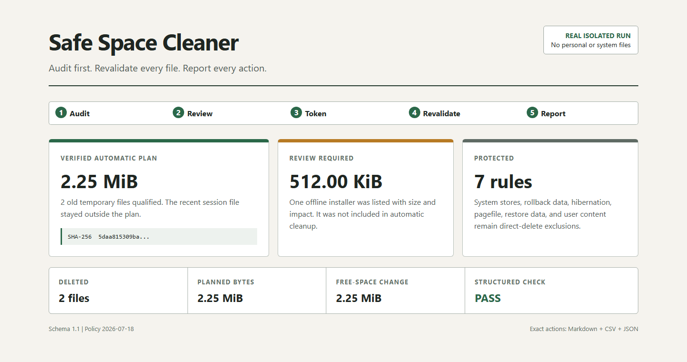

# Safe Space Cleaner

面向 Codex 的 Windows 安全空间清理 skill。默认审计 `C:` 盘，以“可直接清理、需要选择、绝不直删”三层策略释放空间，并生成可逐项复核的 Markdown、CSV 和 JSON 报告。

Safe Space Cleaner is an auditable Windows disk-cleanup skill for Codex. It separates verified temporary files from review-required candidates and protected system or user data.



## 为什么需要它

普通清理脚本常把“体积大”误当成“可以删”。本项目把安全性写进执行机制：

- 默认盘符为 `C:`，但支持指定其它 Windows 盘符。
- 默认先审计，不在扫描阶段删除文件。
- 自动清理只接受固定白名单、超过保留期、审计后未变化的文件。
- 候选 ID 由规范化路径生成稳定哈希，重复审计可以对应同一对象。
- 审计计划使用 SHA-256 令牌锁定；计划被修改后拒绝执行。
- 执行时逐项复核盘符、根目录、路径边界、大小、时间戳、文件属性和保留期。
- 不递归删除目录，不跟随符号链接、联接点或离线占位符。
- 旧安装包、大文件、诊断文件、浏览器和开发缓存只进入候选清单，由用户选择。
- WinSxS、Windows Installer、Windows Update 存储、休眠文件、页面文件、还原点、虚拟磁盘和用户内容绝不直接删除。
- 每个计划文件都有最终状态：`Deleted`、`SkippedMissing`、`SkippedChanged` 或 `Failed`。
- 深度候选按类别设置时间预算，超时或权限不足时明确标记为部分计量。

## 三层交互策略

| 层级 | 示例 | 默认动作 |
| --- | --- | --- |
| 可直接清理 | 超过保留期的当前用户临时文件、Windows 临时文件、DirectX 着色器缓存 | 写入带令牌的精确计划；用户已经要求清理时可执行 |
| 需要选择 | NVIDIA/浏览器/IDE 缓存、崩溃转储、pip/uv/npm 等开发缓存、旧安装包、归档和大文件 | 列出 ID、路径、大小、影响和推荐命令，等待逐项批准 |
| 绝不直删 | 文档与下载内容、云文件、回收站、Windows.old、WinSxS、安装与更新存储、休眠/页面文件、还原点、虚拟磁盘 | 只说明风险和受支持入口 |

“力度大”体现在深度发现和高收益排序，不体现在降低保护级别。

## 安装

克隆仓库后，把 skill 目录复制到 Codex skills 目录：

```powershell
git clone https://github.com/KangWang42/safe-space-cleaner.git
Copy-Item -Recurse -Force `
  .\safe-space-cleaner\safe-space-cleaner `
  "$HOME\.codex\skills\safe-space-cleaner"
```

也可以直接让 Codex 使用仓库内的 `safe-space-cleaner/SKILL.md`。

## 在 Codex 中使用

典型请求：

```text
使用 $safe-space-cleaner 深度审计我的 C 盘。直接清理安全临时文件，
把旧安装包、开发缓存和大文件列出来让我决定，并生成完整报告。
```

```text
使用 $safe-space-cleaner 只审计 D 盘，不删除任何文件。
```

```text
根据上一次报告，清理我明确选择的 npm-cache 和 file-xxxx，
其它候选保持不动。
```

## 直接运行 PowerShell

要求 Windows PowerShell 5.1 或 PowerShell 7；不需要安装第三方依赖。

只读深度审计：

```powershell
$script = '.\safe-space-cleaner\scripts\space-cleaner.ps1'
& $script -Mode Audit -Drive C -Profile Aggressive -MinAgeDays 7 `
  -DeepScan -ReviewTimeoutSeconds 180 -ReportDirectory .\local-reports
```

审阅生成的 Markdown 报告后，用完整计划路径和完整 SHA-256 令牌执行自动清理：

```powershell
& $script -Mode Clean -Drive C `
  -PlanPath '.\local-reports\plan-<run-id>.json' `
  -ConfirmationToken '<full-sha256-token>' `
  -ReportDirectory .\local-reports
```

人机交互模式：

```powershell
& $script -Mode Interactive -Drive C -Profile Aggressive -DeepScan `
  -ReportDirectory .\local-reports
```

交互模式仍然只执行“可直接清理”计划。候选清单必须按生成的 ID 或精确路径另行确认。

不加 `-DeepScan` 时执行快速审计，仍生成自动计划、应用缓存、诊断文件和旧安装包清单；加上后进一步统计开发缓存和用户目录中的大文件。单个候选类别超过 `-ReviewTimeoutSeconds` 时停止该类别并标记为不完整，其数值只作为下限。

## Safe 与 Aggressive

| 配置 | 最短保留期 | 自动清理类别 |
| --- | ---: | --- |
| `Safe` | 至少 30 天 | 用户临时文件、Windows 临时文件 |
| `Aggressive` | 默认 7 天，可调整 | 上述类别加 DirectX 着色器缓存 |

两种配置都不会自动删除浏览器资料、开发缓存、崩溃转储、旧安装包、用户文件或系统受保护内容。

## 报告内容

每次审计生成：

- `audit-<run-id>.md`：人读摘要、候选清单、影响与受保护项；
- `audit-files-<run-id>.csv`：自动计划的完整文件清单；
- `review-candidates-<run-id>.csv`：等待用户选择的完整候选清单；
- `scan-issues-<run-id>.csv`：访问拒绝、时间预算和重解析跳过的完整记录；
- `audit-<run-id>.json`：机器可读审计结果；
- `plan-<run-id>.json`：由 SHA-256 令牌锁定的删除计划。

执行后生成：

- `cleanup-<run-id>.md`：清理结论、状态汇总和前后空间；
- `cleanup-<run-id>.csv`：每个计划文件的最终动作；
- `cleanup-<run-id>.json`：完整机器可读记录。

报告包含本机路径和软件使用线索，默认写入 Git 忽略的 `local-reports/`。不要把真实报告提交到公开仓库。

## 设计边界

- 不格式化、分区、压缩系统盘或修改注册表。
- 不安装、升级或卸载软件与运行环境。
- 不自动请求管理员权限，不因“访问被拒绝”降低安全检查。
- 不停止应用、Windows Update、系统服务或安全软件来强制删除。
- 不用手工目录删除替代 DISM、Disk Cleanup、Storage Sense 或包管理器的官方清理入口。
- 计划字节数与实际空闲空间变化分别报告；压缩、稀疏文件、硬链接和并发写入可能导致两者不同。
- 异常检查读取结构化状态，不在任意文件路径中搜索 `warning`、`failed` 或 `nan`，避免文件名误报。

详细规则见 [安全策略](safe-space-cleaner/references/safety-policy.md) 和 [Windows 清理类别与依据](safe-space-cleaner/references/windows-cleanup-categories.md)。

## 调研依据

策略以微软的 Storage Sense、Disk Cleanup、WinSxS 维护、Delivery Optimization 和休眠文档为边界，并使用 pip、uv、npm 的官方缓存命令。特别遵守以下结论：

- Windows.old 删除后无法回退旧版 Windows；
- WinSxS 不得手工删除；
- Downloads 与云文件不应在默认清理中处理；
- uv 明确要求使用 `uv cache clean`，不得直接修改缓存目录；
- npm 将“回收磁盘空间”列为清缓存的有效理由，但要求显式 `--force`。

直接链接集中在 [windows-cleanup-categories.md](safe-space-cleaner/references/windows-cleanup-categories.md)。

## 验证

```powershell
powershell -NoProfile -ExecutionPolicy Bypass -File .\tests\test-space-cleaner.ps1
& .\safe-space-cleaner\scripts\check-report.ps1 `
  -Path .\local-reports\audit-<run-id>.json
python "$HOME\.codex\skills\.system\skill-creator\scripts\quick_validate.py" `
  .\safe-space-cleaner
```

隔离测试验证：旧文件删除、近期文件保留、审计后变化的文件保留、计划被修改后令牌拒绝，以及联接点目标不进入计划。

## 许可证

[MIT](LICENSE)

本工具涉及不可逆删除。请先阅读审计报告并保留可靠备份；项目不替代 Windows 官方备份、恢复或企业终端管理策略。
